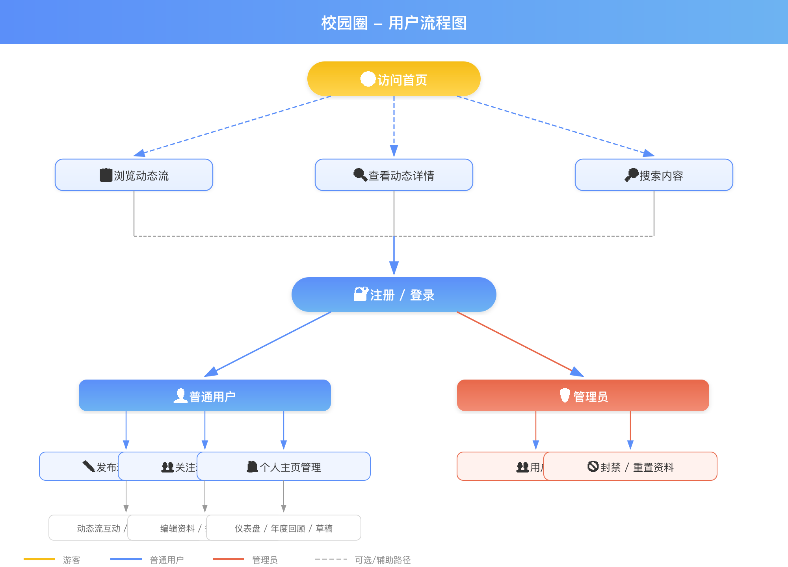
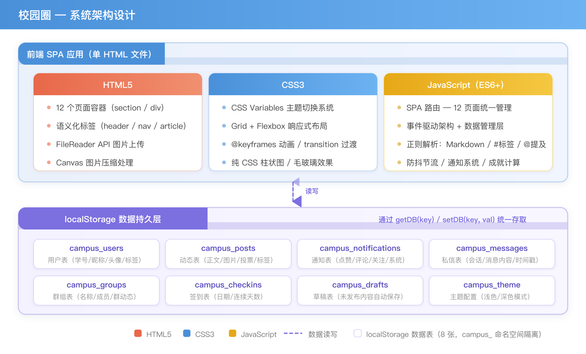

# 校园圈 - 校园生活交友平台 实验报告

---

## 一、整体分析与平台设计（5分）

### 1.1 项目目标

本项目旨在设计并实现一个模拟的「校园生活交友平台」——校园圈（CampusCircle），参考微博、抖音、小红书等主流社交平台的核心交互模式，为校内学生提供动态发布、社交互动、内容浏览的一站式平台。系统需满足以下核心目标：

1. **内容浏览**：普通游客可访问首页，浏览平台公开动态内容
2. **用户系统**：学生通过学号注册账号，管理个人资料与主页
3. **动态发布**：登录用户可发布图文动态，支持点赞、评论等互动
4. **社交关系**：用户间关注/取关，构建校园社交网络
5. **管理后台**：管理员可管理用户账号，维护平台秩序

### 1.2 用户流程设计



**核心用户流程说明：**

- **游客流程**：进入首页 → 浏览全站动态流 → 查看动态详情 → 注册/登录
- **注册登录流程**：输入学号 → 表单校验 → 设置头像/昵称/标签 → 注册成功 → 登录（支持记住我/密码可见/忘记密码）
- **内容发布流程**：进入发布页 → 编写内容（支持 Markdown/表情/图片/投票/标签） → 设置可见范围 → 发布（自动保存草稿）
- **社交互动流程**：浏览动态 → 点赞/评论/@提及 → 关注作者 → 查看关注动态流 → 私信交流
- **个人管理流程**：个人主页 → 编辑资料 → 查看仪表盘/成就/签到/年度回顾
- **管理员流程**：管理面板 → 查看用户列表 → 封禁/解封 → 重置资料

### 1.3 技术选型

| 技术层 | 选型 | 选型理由 |
|--------|------|----------|
| 页面结构 | HTML5 | 语义化标签（header/nav/main/article/section），FileReader API 图片上传，IntersectionObserver API 无限滚动 |
| 样式主题 | CSS3 | CSS Variables 实现主题切换，Grid/Flexbox 响应式布局，@keyframes 动画过渡，纯 CSS 柱状图 |
| 业务逻辑 | JavaScript (ES6+) | SPA 路由、事件驱动、正则解析（Markdown/标签/提及）、DOM 操作封装 |
| 数据持久化 | localStorage | 无需后端，JSON 序列化存储，7 张数据表命名空间隔离，即开即用 |
| 图片存储 | Base64 Data URI | FileReader 读取本地图片转 base64，无需图床或后端存储 |
| 项目依赖 | 零依赖 | 纯原生实现，无框架/库引入，单 HTML 文件包含全部代码 |

### 1.4 架构设计



---

## 二、个人模块设计与实现（20分）

### 2.1 SPA 路由与页面管理

**HTML 结构设计：**
采用单一 HTML 文件承载全部页面，每个页面作为独立的 `<section>` 或 `<div>` 容器，默认隐藏。通过 CSS `display: none/block` 控制页面显隐，配合 `@keyframes fadeIn` 实现 0.3s 淡入过渡动画，保证页面切换的视觉连贯性。

```html
<!-- 页面容器结构示例 -->
<div id="page-home" class="page-container">
  <!-- 首页内容 -->
</div>
<div id="page-login" class="page-container" style="display:none">
  <!-- 登录页内容 -->
</div>
<div id="page-profile" class="page-container" style="display:none">
  <!-- 个人主页内容 -->
</div>
```

**CSS 动画设计：**
使用 `@keyframes fadeIn` 定义页面进入动画，从 `opacity: 0; transform: translateY(10px)` 过渡到完全显示，时长 0.3s，缓动函数 `ease`，营造流畅的页面切换体验。

**JS 路由逻辑：**
核心函数 `navigate(page, data)` 统一管理 12 个页面路由：首页、登录、注册、发布、动态详情、个人主页、用户主页、私信、群组、群组详情、搜索、管理员面板。流程为：权限校验 → 隐藏当前页面 → 更新侧边栏导航高亮 → 渲染目标页面内容 → 显示目标页面 → 移动端自动关闭侧边栏。

```javascript
function navigate(page, data) {
  // 权限校验：访客访问受保护页面时跳转登录页
  const authPages = ['create', 'messages', 'dashboard', 'admin', 'edit-profile', 'groups', 'group-detail'];
  if (!currentUser && authPages.includes(page)) {
    toast('请先登录后再使用此功能', 'warning'); navigate('login'); return;
  }
  // 隐藏所有页面容器，显示目标页面
  document.querySelectorAll('.page').forEach(p => p.classList.remove('active'));
  document.getElementById('page-' + page).classList.add('active');
  // 更新侧边栏导航激活状态
  document.querySelectorAll('.sidebar-nav a').forEach(a => a.classList.remove('active'));
  document.querySelector('[data-page="' + page + '"]').classList.add('active');
  // 移动端关闭侧边栏
  document.getElementById('sidebar').classList.remove('open');
  // 根据 page 名称调用对应渲染函数
  switch(page) {
    case 'home': feedPage = 0; hasMorePosts = true; renderHome(); break;
    case 'profile': renderProfile(data); break;
    // ... 共 12 个路由分支
  }
  updateNavUI();
}
```

**页面布局架构（YouTube 风格）：**
采用顶栏 + 左侧导航栏 + 主内容区的三层固定布局结构：

- **顶栏**（`position: fixed; top: 0; z-index: 200; height: 56px`）：左侧 Logo 和移动端汉堡菜单按钮，中间全宽搜索框（`border-radius: 22px` 圆角药丸形），右侧主题切换、签到按钮、通知铃铛（含未读徽章）、用户头像和昵称
- **左侧导航栏**（`position: fixed; top: 56px; bottom: 0; width: 220px; z-index: 150`）：垂直排列的导航链接（含 icon + 文字），激活项背景为 `var(--accent)` 色，下方有分隔线和签到区。菜单项根据登录状态和用户角色（普通用户/管理员）动态显示
- **主内容区**（`margin-left: 220px; margin-top: 56px`）：所有页面容器，通过 CSS `display: none` + `@keyframes fadeIn` 控制显隐和 0.35s 淡入动画

**响应式布局策略：**
- > 900px：完整三栏布局
- ≤ 900px：侧边栏默认隐藏（`transform: translateX(-100%)`），点击汉堡按钮滑入显示（带 `box-shadow` 阴影），点击内容区外部自动关闭；主内容区 `margin-left: 0`
- ≤ 600px：用户昵称隐藏，搜索框缩小
- ≤ 400px：顶部搜索栏隐藏，仅保留 Logo 和用户操作区

**访客权限控制：**
侧边栏所有功能菜单对访客和登录用户均保持可见（仅管理员面板隐藏），点击受保护功能时自动跳转登录页：

- `navigate()` 内置权限校验：`authPages` 数组包含 `create`、`messages`、`dashboard`、`admin`、`edit-profile`、`groups`、`group-detail` 共 7 个受保护页面，访客访问时弹出提示并重定向至登录页；非管理员用户访问 admin 页面弹出「无权限访问」错误
- `switchFeed('following')`：访客点击「关注动态」标签时跳转登录页
- `doCheckIn()`：访客点击签到按钮时跳转登录页
- `renderProfile(null)`：访客点击「我的主页」时跳转登录页
- 点赞、评论、投票、关注、私信等内联操作：通过 `if(!currentUser){toast('请先登录','warning');return}` 守卫拦截，仅弹出提示不跳转页面

**CSS 变量与内容宽度：**
主内容区最大宽度通过 CSS 变量 `--max-width: 880px` 控制，在 1366px 分辨率屏幕上（扣除 220px 侧边栏后可用宽度约 1146px），内容区占比约 77%，两侧留白约 133px，兼顾阅读舒适性和空间利用率。

**侧边栏用户信息卡片：**
在侧边栏导航菜单下方增设用户信息展示卡片（`#sidebarProfileCard`），作为用户个人主页的快捷入口。卡片设计为垂直居中布局，包含三个核心区域：

- **头像区**：72×72 圆形头像（`.spc-avatar`），包裹 3px 主题色边框（`var(--accent)`），hover 时轻微放大（`scale(1.04)`）
- **昵称区**：17px 加粗字体（`font-weight: 650`），居中显示
- **数据统计区**：纵向排列三行数据——动态数、关注数、粉丝数，数值以主题色加粗突出显示（`color: var(--accent); font-weight: 700`），字体大小 15px

卡片在登录和未登录两种状态下展示不同内容：

```javascript
function renderSidebarProfile(){
  if(currentUser){
    $('spcAvatar').src=currentUser.avatar;
    $('spcNickname').textContent=currentUser.nickname;
    const posts=getPosts().filter(p=>p.userId===currentUser.id&&!p.isDeleted);
    $('spcPosts').textContent=posts.length;
    $('spcFollowing').textContent=currentUser.following.length;
    $('spcFollowers').textContent=currentUser.followers.length;
  }else{
    $('spcAvatar').src=DEFAULT_AVATAR;
    $('spcNickname').textContent='未登录';
    $('spcPosts').textContent='0';
    $('spcFollowing').textContent='0';
    $('spcFollowers').textContent='0';
  }
}
```

卡片整体可作为「我的主页」快捷入口（`onclick="navigate('profile')"`），hover 时背景变为 `var(--accent-light)` 提供视觉反馈。`renderSidebarProfile()` 在 `updateNavUI()`（登录/退出/导航时调用）和 `toggleFollow()`（关注/取关操作后）中触发更新，确保数据实时同步。点击卡片后跳转至个人主页，登录用户可查看和编辑完整个人资料。

### 2.2 用户认证系统

**HTML 表单设计：**
注册表单包含学号、昵称、密码、确认密码四个必填字段，以及头像上传（FileReader + `<canvas>` 压缩）、个人简介（`<textarea>`）、兴趣标签（动态 chip 组件）。登录表单包含学号、密码，附带"记住我"复选框、"密码可见"切换按钮、"忘记密码"链接。

- 表单布局采用 CSS Grid 单列结构，`gap: 16px` 控制字段间距
- 头像上传区域为 120×120 圆形点击热区，hover 时显示半透明遮罩层和相机图标
- 兴趣标签使用 `flex-wrap` 布局，每个标签为圆角 chip，带 × 删除按钮

**CSS 样式设计：**
- 输入框统一样式：`border: 1px solid var(--border-color)`、`border-radius: 8px`、`padding: 12px`、focus 时边框切换为主题色
- 错误提示使用 `color: #e74c3c` + `font-size: 0.85rem`，通过 CSS transition 平滑出现
- 密码可见按钮使用绝对定位叠加在密码输入框右侧，点击切换 `type="password"` ↔ `type="text"`
- 表单卡片使用 `max-width: 440px` + `margin: 0 auto` 居中，`box-shadow` 提升层次感

**JS 校验逻辑：**
- 学号格式校验：正则 `/^\d{8,12}$/`，仅允许 8-12 位数字
- 唯一性检查：遍历 `users` 表确认学号未被注册
- 昵称长度校验：2-20 字符，`trim()` 去除首尾空格
- 密码校验：6-20 字符，两次输入一致性比对
- 实时校验：每个字段绑定 `input` 事件，即时反馈错误信息
- 兴趣标签：Enter 键添加新标签，去重检查，上限 10 个

**登录按钮居中设计：**
登录按钮采用居中布局（`text-align: center` 包裹），按钮宽度使用固定内边距 `padding: 12px 48px` 替代 `width: 100%` 的全宽设计，视觉上更加聚焦和精致，符合主流社交产品的登录页设计风格。注册按钮保持全宽（`width: 100%`），以区分主次操作。

**登录增强实现：**
- "记住我"：勾选后将登录态（userId）写入 localStorage，页面初始化时调用 `checkAutoLogin()` 自动恢复会话
- "密码可见"：点击眼睛图标切换 `input.type` 属性，同时切换图标（👁/👁‍🗨）
- "忘记密码"：点击弹出提示框，引导用户联系管理员重置
- 封禁检测：登录时查询 `user.isBanned` 字段，若为 true 则拒绝登录并提示"账号已被封禁"

### 2.3 动态发布与浏览模块

#### 2.3.1 动态发布

**HTML 结构：**
发布页的核心是内容编辑区域，包含正文 `<textarea>`、图片预览区（CSS Grid 3 列自适应）、可见范围 `<select>`、投票选项（动态添加的 input 列表）、话题标签输入框。底部固定工具栏包含发布按钮、表情按钮、图片上传按钮、投票/标签切换按钮。

**CSS 布局设计：**
- 发布区域采用 `max-width: 680px` + 居中布局
- 图片预览网格：`grid-template-columns: repeat(auto-fill, minmax(100px, 1fr))`，图片以 `aspect-ratio: 1` 方形裁切展示
- 工具栏使用 `position: sticky; bottom: 0` + `backdrop-filter: blur(10px)` 实现毛玻璃固定效果
- 可见范围选择器使用自定义下拉样式，选项包括公开（🌐）、仅好友（👥）、仅自己（🔒）

**JS 功能实现：**

*图片上传处理：*
```javascript
function handleImageUpload(file) {
  const reader = new FileReader();
  reader.onload = function(e) {
    const img = new Image();
    img.onload = function() {
      // Canvas 压缩：限制最大宽度 800px，质量 0.7
      const canvas = document.createElement('canvas');
      const ratio = Math.min(1, 800 / img.width);
      canvas.width = img.width * ratio;
      canvas.height = img.height * ratio;
      canvas.getContext('2d').drawImage(img, 0, 0, canvas.width, canvas.height);
      const compressed = canvas.toDataURL('image/jpeg', 0.7);
      postImages.push(compressed);
      renderImagePreviews();
    };
    img.src = e.target.result;
  };
  reader.readAsDataURL(file);
}
```

*投票动态创建与投票逻辑：*
动态添加投票选项输入框，选项数量 2-6 个。发布后生成 `type: 'poll'` 的动态对象，投票数据存储在 `pollVotes` 对象中（结构：`{ userId: optionIndex }`，key 为用户 ID，value 为选项索引）。`votePoll(postId, optIdx)` 将当前用户的投票选择写入 `p.pollVotes[currentUser.id] = optIdx`，然后重置分页状态（`feedPage=0; hasMorePosts=true`）并重新渲染首页。若当前处于详情页，同步调用 `renderPostDetail(postId)` 刷新投票结果。

**投票计数实现要点：**
- 总投票人数：`Object.keys(p.pollVotes).length`（统计 pollVotes 的 key 数量，即投票用户数）
- 每选项票数：`Object.values(p.pollVotes).filter(v => v === i).length`（遍历所有用户的投票值，筛选投给选项 i 的用户数）
- 百分比计算：`Math.round(每选项票数 / 总投票人数 * 100)`

> 修复记录：初版实现错误地使用 `Object.values(pollVotes).reduce((s,v)=>s+v,0)` 将选项索引相加作为总票数（3 人投票可能算出总票数 = 1），且用 `pollVotes[i]` 以选项索引直接访问用户 ID 为 key 的映射表（始终返回 undefined）。已修正为上述基于 key 计数和 value 筛选的正确方案。

*话题标签提取：*
发布时通过正则 `/#(\S+)/g` 从正文中提取 #话题 标签，存入 `tags` 数组，渲染时高亮显示。

*@提及检测：*
发布时通过正则 `/@(\w+)/g` 提取被提及用户，自动向被提及者发送通知。

#### 2.3.2 动态流渲染

**HTML 动态卡片结构：**
每张动态卡片为独立的 `<article>` 元素，包含：
- 头部：发布者头像（40×40 圆形）+ 昵称 + 发布时间（相对时间）
- 正文：Markdown 渲染后的富文本内容
- 图片区：CSS Grid 多图布局（1 张大图 / 2 图并排 / 3+ 图九宫格）
- 标签区：话题标签 chip 列表
- 投票区（可选）：投票选项 + 实时百分比条形图
- 底部操作栏：点赞按钮（含计数）、评论按钮、删除按钮（仅本人/管理员可见）

**CSS 卡片设计：**
- 卡片背景：`var(--card-bg)`，圆角 `12px`，`box-shadow` 微阴影
- 头像：`width: 40px; height: 40px; border-radius: 50%; object-fit: cover`
- 相对时间文字使用 `color: var(--text-secondary); font-size: 0.8rem`
- 操作按钮使用 `display: flex; justify-content: space-around` 均匀分布
- 点赞按钮激活态：`color: #e74c3c`，带 `transform: scale(1.2)` 弹性动画
- 代码块样式：深色背景 `#2d2d2d`，等宽字体 `Consolas, monospace`，圆角 8px

**JS 渲染逻辑：**
`renderPostList(posts)` 函数遍历动态数组，对每条动态依次调用：`escapeHtml()` 安全转义 → `renderMarkdown()` Markdown 渲染 → 生成 HTML 字符串 → `insertAdjacentHTML('beforeend', html)` 追加到列表容器。

#### 2.3.3 动态详情页

动态详情页复用 `renderPostCard()` 生成的卡片 HTML 结构，通过 `renderPostDetail(postId)` 函数渲染完整的动态内容和评论区域。页面包含以下核心区块：

- **动态头部**：发布者头像（44×44 圆形）+ 昵称 + 发布时间（含「已编辑」标记），作者头像和昵称均可点击跳转至其个人主页
- **动态正文**：调用 `renderMarkdown()` 渲染富文本内容，支持 Markdown 语法、@提及高亮、话题标签
- **图片展示**：CSS Grid 自适应布局（1/2/3 列），点击图片弹出全屏大图模态框（`showImageModal`）
- **投票区**（可选）：投票选项带实时百分比进度条，当前用户已投票项高亮显示
- **标签区**：话题标签以 chip 样式展示
- **底部操作栏**：点赞按钮（含计数和动画反馈）、评论计数
- **评论列表**：每条评论展示评论者头像、昵称、内容（支持 Markdown/表情渲染）、相对时间戳
- **评论输入区**：内嵌于评论卡片底部的输入框，支持 Emoji 选择器（`toggleEmojiPicker`）和 @提及功能，按 Enter 键或点击发送按钮提交评论。评论成功后自动发送通知给被评论者和被 @提及的用户

#### 2.3.4 动态编辑与删除

- **编辑**：发布者可点击自己动态的编辑按钮，弹出模态编辑框，预填原始内容，修改后更新 `content` 和 `updatedAt` 字段，卡片显示「已编辑」标记
- **删除**：采用软删除策略，设置 `isDeleted: true`，渲染时过滤已删除动态，保留数据以便恢复
- **可见范围切换**：编辑时可修改 `visibility` 字段（public/friends/private），首页渲染时按规则过滤

#### 2.3.5 Markdown 渲染引擎

**CSS 样式映射：**

| Markdown 语法 | HTML 输出 | CSS 样式 |
|--------------|-----------|----------|
| `# 标题` | `<h1>`/`<h2>`/`<h3>` | font-size: 1.5/1.3/1.1em, font-weight: 700, margin: 0.5em 0 |
| `**加粗**` | `<strong>` | font-weight: 600 |
| `*斜体*` | `<em>` | font-style: italic |
| `` `代码` `` | `<code>` | background: #f0f0f0, padding: 2px 6px, border-radius: 4px, monospace |
| ` ```代码块``` ` | `<pre><code>` | background: #2d2d2d, color: #f8f8f2, padding: 16px, border-radius: 8px |
| `- 列表` | `<ul><li>` | padding-left: 1.5em |
| `> 引用` | `<blockquote>` | border-left: 3px solid var(--primary), padding-left: 12px, color: #666 |
| `@用户名` | `<span class="mention">` | color: var(--primary), font-weight: 600, background 高亮 |

**JS 安全渲染流程：**
先 `escapeHtml()` 转义所有 `< > & " '` 为 HTML 实体，再执行 8 条正则替换规则（代码块 → 行内代码 → 标题 → 加粗 → 斜体 → 列表 → 引用 → 提及），确保渲染输出不含攻击代码。代码块使用 `replace()` 回调函数，优先匹配多行 ``` 语法，匹配到的内容不再被后续规则处理。

### 2.4 互动与社交模块

#### 2.4.1 关注/取关系统

**HTML 结构：**
个人主页和用户主页头部展示关注按钮。未关注时显示「+ 关注」蓝色按钮，已关注时显示「✓ 已关注」灰色按钮，hover 已关注按钮变为红色并显示「取消关注」。

**CSS 按钮设计：**
- 关注按钮：`background: var(--primary); color: #fff; border-radius: 20px; padding: 8px 24px`
- 已关注态：`background: var(--btn-secondary-bg)`，hover 时 `background: #e74c3c; content: "取消关注"`
- 粉丝/关注数在头部以数字形式展示，点击可查看列表

**JS 实现：**
`toggleFollow(targetId)` 函数：检查当前用户 `following` 数组是否包含目标 ID → 包含则 `splice()` 移除，同时从对方 `followers` 中移除 → 不包含则 `push()` 添加 → 写回 `users` 表 → 更新 UI → 发送关注/取关通知。

#### 2.4.2 点赞与评论

**点赞实现：**
点击点赞按钮触发 `toggleLike(postId)`：检查 `likes` 数组 → 添加/移除当前用户 ID → 写回 `posts` 表 → 更新按钮状态和计数 → 发送通知。按钮点击有 300ms 缩放动画（`transform: scale(1.2) → scale(1)`），防止快速连点。

**评论实现：**
评论输入框绑定 Enter 键快捷发送。`addComment(postId, content)` 函数构造评论对象 `{userId, content, timestamp}` push 到动态的 `comments` 数组 → 写回 → 重新渲染详情页 → 通知动态作者。评论支持表情选择器插入和 @提及解析。

#### 2.4.3 全站/关注动态切换

首页顶部提供两个 Tab：「全站动态」和「关注动态」。默认为全站模式。切换时 JS 重新过滤数据源：
- 全站：所有 `visibility !== 'private'` 的动态，按时间倒序
- 关注：仅当前用户 `following` 列表中用户发布的公开/好友可见动态

Tab 切换使用 CSS `border-bottom: 2px solid var(--primary)` 标识激活态，配合 `transition: border-color 0.3s` 平滑过渡。

#### 2.4.4 私信系统

**HTML 结构：**
私信页面分为左右两栏：左侧会话列表（用户头像 + 最后消息预览），右侧聊天窗口（消息气泡 + 输入框）。

**CSS 气泡设计：**
- 我方消息：右对齐，蓝色背景 `var(--primary)`，白色文字，右下圆角为直角
- 对方消息：左对齐，灰色背景 `var(--bubble-bg)`，左下圆角为直角
- 消息内容支持 Markdown 渲染

**JS 实现：**
- `sendMessage(toId, content)`：构造消息对象，写入 `messages` 表，通知接收方
- Enter 键发送，Shift+Enter 换行
- 表情选择器集成
- 会话列表按最后消息时间倒序排列

#### 2.4.5 主题切换（夜间模式）

**CSS Variables 设计：**
在 `:root` 中定义一套 CSS 变量（浅色主题）：`--bg`, `--card-bg`, `--text`, `--text-secondary`, `--border`, `--primary` 等。在 `[data-theme="dark"]` 中覆写所有变量为深色值。

```css
:root {
  --bg: #f5f5f5;
  --card-bg: #ffffff;
  --text: #333333;
  --text-secondary: #888888;
  --border: #e0e0e0;
  --primary: #4A90D9;
  /* ... */
}

[data-theme="dark"] {
  --bg: #1a1a2e;
  --card-bg: #16213e;
  --text: #e0e0e0;
  --text-secondary: #a0a0a0;
  --border: #2a2a4a;
  --primary: #6db3f2;
  /* ... */
}
```

**JS 切换逻辑：**
点击导航栏主题按钮 → 切换 `document.documentElement` 的 `data-theme` 属性 → 更新 localStorage 持久化主题偏好 → 页面所有使用 `var(--xxx)` 的元素自动响应，无需逐个修改样式。

### 2.5 通知中心

**HTML 结构：**
导航栏铃铛图标 + 未读红点徽章（`position: absolute; top: -4px; right: -4px`）。点击弹出下拉通知面板（`position: absolute`，300px 宽，max-height 400px 滚动），每条通知为 flex 行布局，左侧 3px 蓝色边框标记未读。

**CSS 设计：**
```css
.notification-badge {
  position: absolute;
  top: -4px; right: -4px;
  min-width: 18px; height: 18px;
  background: #e74c3c;
  color: #fff; font-size: 0.7rem;
  border-radius: 9px;
  display: flex; align-items: center; justify-content: center;
}
.notification-item.unread {
  border-left: 3px solid var(--primary);
  background: var(--unread-bg);
}
```

**JS 实现：**
- `addNotification(userId, type, fromUserId, postId, content)`：创建通知对象，限制总数 50 条
- `updateNotifBadge()`：遍历通知表计算未读数，更新铃铛徽章
- 通知面板：点击铃铛渲染列表 → 点击某条通知 → 关闭面板 → `navigate()` 跳转目标 → 标记已读
- 「全部已读」按钮：遍历所有通知设置 `read: true` → 更新 UI

### 2.6 表情选择器

**HTML 结构：**
触发按钮（😊）点击后弹出模态浮层，内含 8×8 网格布局，共 64 个 emoji。每个 emoji 为 36×36 点击热区，hover 时背景高亮并 `scale(1.2)` 放大。

**CSS Grid 设计：**
```css
.emoji-grid {
  display: grid;
  grid-template-columns: repeat(8, 1fr);
  gap: 4px;
  max-width: 320px;
  padding: 8px;
}
.emoji-item {
  cursor: pointer;
  padding: 4px;
  text-align: center;
  font-size: 1.4rem;
  border-radius: 6px;
  transition: transform 0.15s, background 0.15s;
}
.emoji-item:hover {
  background: var(--hover-bg);
  transform: scale(1.2);
}
```

**JS 光标插入：**
获取目标 textarea/input 的 `selectionStart` 和 `selectionEnd`，在光标位置插入 emoji 字符，自动聚焦回输入框并设置新的光标位置。

### 2.7 草稿箱系统

**HTML 状态提示：**
发布页顶部显示「📝 已保存草稿 [时间]」灰色提示条，右侧有「恢复」和「清除」两个操作链接。

**JS 自动保存：**
对发布页的 textarea 和 input 绑定 `input` 事件，通过 500ms 防抖（debounce）减少写入频率。每次触发时将正文、图片数组、可见范围、投票选项序列化为 JSON 写入 `campus_drafts`。

页面加载时检查是否有草稿 → 弹窗询问「检测到未发布的草稿，是否恢复？」→ 确认则回填所有字段 → 取消则清除草稿。

### 2.8 无限滚动

**HTML 设计：**
动态列表底部放置哨兵元素 `<div id="sentinel" style="height:1px"></div>`。

**JS 实现：**
使用 `IntersectionObserver` 监听哨兵元素进入视口。回调函数中检查 `currentPage * pageSize < totalPosts`，若还有更多数据则加载下一页（每次 5 条），通过 `insertAdjacentHTML('beforeend', ...)` 追加而非整体重绘。全部加载完毕后移除 observer 并隐藏加载提示。

### 2.9 成就徽章系统

**CSS 徽章设计：**
8 种徽章以 Grid 3 列布局排列在个人主页。已解锁徽章为彩色 + `opacity: 1` + 发光 `box-shadow`，未解锁为灰色 + `opacity: 0.4` + `filter: grayscale(1)`。

**JS 计算逻辑：**
```javascript
function getAchievements(userId) {
  const posts = getAllPosts().filter(p => p.userId === userId);
  const totalLikes = posts.reduce((sum, p) => sum + p.likes.length, 0);
  const user = getUser(userId);
  const checkinStreak = getCheckinStreak(userId);
  return [
    { name: '初来乍到', icon: '📝', unlocked: posts.length >= 1 },
    { name: '内容创作者', icon: '✍️', unlocked: posts.length >= 10 },
    { name: '校园博主', icon: '📰', unlocked: posts.length >= 50 },
    { name: '人气之星', icon: '❤️', unlocked: totalLikes >= 50 },
    { name: '爆款制造者', icon: '🔥', unlocked: totalLikes >= 500 },
    { name: '社交达人', icon: '👥', unlocked: user.followers.length >= 20 },
    { name: '坚持七天', icon: '📅', unlocked: checkinStreak >= 7 },
    { name: '月度劳模', icon: '🏆', unlocked: checkinStreak >= 30 },
  ];
}
```

### 2.10 数据仪表盘

**HTML + CSS 柱状图设计：**
不使用 Canvas/SVG/图表库，纯 CSS 实现柱状图。每个柱子为 `<div>`，通过 `height` 百分比表示数据大小，使用 `align-self: flex-end` 底部对齐。

```css
.bar-chart {
  display: flex;
  align-items: flex-end;
  gap: 8px;
  height: 150px;
  padding: 8px;
}
.bar {
  flex: 1;
  background: var(--primary);
  border-radius: 4px 4px 0 0;
  transition: height 0.5s ease;
  position: relative;
}
.bar-label {
  position: absolute;
  bottom: -20px;
  width: 100%;
  text-align: center;
  font-size: 0.75rem;
}
```

**JS 数据聚合：**
`getWeeklyStats(userId)` 遍历用户近 7 天的发布动态数量，按日期分组计数，生成柱状图数据。`getMonthlyStats()` 类似逻辑，按月聚合近 6 月数据。

### 2.11 每日签到

**JS 实现：**
`doCheckin()` 函数：获取当前日期字符串 `YYYY-MM-DD` → 与上次签到日期比较 → 同一天则提示已签到 → 昨天则 streak+1 → 更早则 streak 重置为 1 → 更新 `checkins` 表 → 渲染连续天数 → 连续 7/30 天触发成就解锁通知。

### 2.12 搜索功能

**HTML 设计：**
导航栏搜索图标 → 点击展开搜索浮层 / 导航到搜索页 → 输入框自动聚焦 → 实时搜索（300ms 防抖）。

**CSS 搜索结果设计：**
- 用户结果：头像 + 昵称 + 学号 + 兴趣标签
- 动态结果：正文预览（截取 80 字）+ 发布者 + 时间
- 关键词高亮：`<mark>` 标签，`background: #fff3cd; padding: 0 2px`

**JS 搜索逻辑：**
采用双输入框单数据源架构——顶栏搜索框仅作为导航触发器，搜索页输入框为唯一搜索数据源：

1. 用户在顶栏搜索框点击或按 Enter → `onSearchFocus()` 触发 → 调用 `navigate('search')` 跳转搜索页 → 将顶栏输入框中的文字同步到搜索页输入框 → 自动聚焦搜索页输入框（光标移至末尾）
2. 搜索页输入框 `oninput` → `doSearch()` 执行搜索 → 结果实时渲染到搜索页

```javascript
function doSearch() {
  const q = $('searchInput').value.trim().toLowerCase();
  // 同步回顶栏搜索框（保持显示一致）
  if ($('globalSearch')) $('globalSearch').value = $('searchInput').value;
  if (!q) { /* 显示空白提示 */ return; }
  // 用户匹配：昵称、学号、兴趣标签
  const users = getUsers().filter(u => !u.isBanned && (
    u.nickname.toLowerCase().includes(q) || u.id.includes(q) ||
    (u.interests && u.interests.some(t => t.toLowerCase().includes(q)))
  ));
  // 动态匹配：正文内容、话题标签
  const posts = getPosts().filter(p => !p.isDeleted && p.visibility === 'public' && (
    p.content.toLowerCase().includes(q) ||
    (p.tags && p.tags.some(t => t.toLowerCase().includes(q)))
  ));
  // 渲染结果并高亮关键词：<mark style="background:#fff3cd">匹配文字</mark>
}
```

搜索支持 Ctrl+K 快捷键快速聚焦顶部搜索框。搜索结果中的关键词使用 `<mark>` 标签黄色高亮显示（`background: #fff3cd`），通过 `highlightQuery()` 函数实现正则匹配替换（关键词经过 `escapeRegex` 转义特殊字符）。

### 2.13 群组系统

**HTML 卡片设计：**
群组列表为 Grid 3 列自适应布局。每张卡片包含群组名称、简介（2 行截断）、成员数、创建者信息、「加入/退出」按钮。

**JS 实现：**
- `createGroup(name, desc)`：生成群组对象，创建者自动成为成员
- `joinGroup(groupId)` / `leaveGroup(groupId)`：操作 members 数组，更新 UI
- 群组详情页展示成员列表，每个成员显示头像 + 昵称，可点击跳转用户主页

### 2.14 年度回顾

**HTML 模态框设计：**
全屏居中模态框（`position: fixed; z-index: 1000`），半透明黑色遮罩（`background: rgba(0,0,0,0.6)`），内容卡片包含年度统计数据和「分享」按钮。

**JS 统计：**
聚合用户全年的动态总数、获赞总数、评论总数、粉丝增长、签到天数，渲染为格式化的年度报告。

### 2.15 管理员面板

**HTML 表格设计：**
用户列表为响应式表格（移动端横向滚动），包含：头像、学号、昵称、状态（正常/封禁）、动态数、注册时间、操作按钮（封禁/解封/重置资料）。

**JS 管理操作：**
- 封禁：设置 `user.isBanned = true`，被禁用户无法登录和发布
- 解封：设置 `user.isBanned = false`
- 重置资料：清空用户昵称、头像、简介、兴趣标签为默认值

---

## 三、项目总结与反思（5分）

### 3.1 项目成果

本项目成功实现了一个功能丰富、交互流畅的校园生活交友平台。在完成作业全部必选需求（首页浏览、用户系统、动态发布、社交互动）的基础上，额外实现了通知中心、表情选择器、投票动态、Markdown 渲染引擎、草稿箱自动保存、成就徽章、数据仪表盘、群组系统、每日签到、@提及用户、年度回顾、无限滚动、主题切换等 13 项高级功能，使平台功能接近真实社交产品水平。

### 3.2 协作过程体会

项目采用分工协作模式，每位成员负责不同的功能模块：
- 通过与团队成员的沟通协调，确定了统一的数据模型接口（localStorage 键名规范、用户 ID 引用方式），保证了各模块间的数据互通
- 利用 Git 进行版本管理，各成员在独立分支开发各自模块，通过合并请求集成，有效避免了代码冲突
- 定期进行进度同步和代码审查，及时发现了数据结构不兼容、样式冲突等问题并修正
- 前端纯静态实现免去了后端部署的复杂性，使得团队成员可以快速在本地进行开发和调试

### 3.3 技术难点回顾

- localStorage 数据管理：7 张数据表的统一 CRUD 封装和命名空间隔离是数据层的基础，通过 `getDB`/`setDB` 工具函数实现了简洁的数据访问层
- Markdown 渲染安全性：必须先转义 HTML 再进行 Markdown 正则替换，顺序不可颠倒，否则存在 XSS 风险
- 通知系统的多事件源：点赞、评论、关注、@提及、群组、系统共 6 种事件源需要统一的创建和展示逻辑
- 草稿自动保存的时机控制：防抖策略避免了频繁写入，但需注意在发布成功后清除草稿
- 投票计数数据结构设计：`pollVotes` 采用 `{ userId: optionIndex }` 的 key-value 映射结构，统计时需基于 `Object.keys()` 计数投票人数、`Object.values().filter()` 计数每选项票数，初版曾误将选项索引相加导致计数完全错误
- 搜索框双输入同步：顶栏搜索框仅作为导航触发器，搜索页输入框为唯一数据源，避免了双输入双向同步带来的状态不一致问题
- 访客权限分层处理：页面级操作（发布、消息、管理）跳转登录页，内联操作（点赞、评论、投票）仅弹 toast 提示不跳转，平衡安全性和用户体验

### 3.4 改进建议

1. **存储方案升级**：当前 localStorage 有 5MB 容量限制，图片 base64 存储占用较大。建议引入 IndexedDB 替代，支持更大的存储容量和结构化查询
2. **实时通信**：当前通知仅在本会话有效，可接入 WebSocket 或 Server-Sent Events 实现真正的实时推送
3. **图片优化**：前端 Canvas 压缩可进一步降低质量参数，或引入 WebP 格式减少存储占用；最佳方案是接入后端图床服务
4. **内容推荐**：当前首页为简单的时间倒序排列，可基于用户兴趣标签和行为数据引入协同过滤推荐算法
5. **PWA 支持**：通过 Service Worker 实现离线访问和本地缓存，提升移动端体验
6. **后端接入**：当前所有数据存储在浏览器本地，切换设备/浏览器后数据丢失。接入后端 API 和数据库可实现真正的多端同步
7. **测试完善**：当前测试为手动功能测试，可引入自动化测试框架（如 Puppeteer/Cypress）覆盖核心用户流程
8. **无障碍优化**：增加 ARIA 标签、键盘导航支持、屏幕阅读器适配，提升平台的无障碍访问能力
